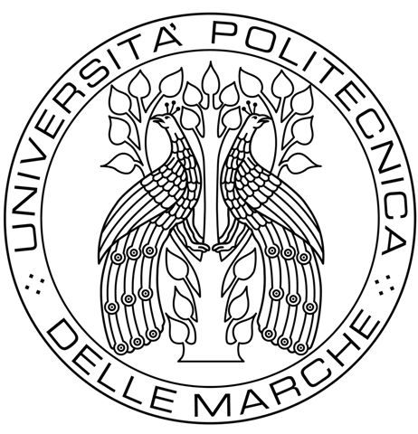

# Progetto Double Propeller Ducted-Fan (DPDF)



Questo repository contiene la documentazione completa e il firmware per l’UAV **Double Propeller Ducted-Fan (DPDF)** sviluppato come parte del corso di *Laboratorio di Automazione* presso l’Università Politecnica delle Marche.

---

## 📌 Panoramica del progetto

Il **DPDF** è un UAV ducted-fan progettato su misura che presenta:

- Due motori brushless controrotanti per una spinta verticale stabile  
- Controllo aerodinamico tramite flap azionati da servo (pitch e roll)  
- Flight controller basato su STM32H745ZI-Q Nucleo  
- Fusione dei sensori tramite IMU BNO-055 per la stima dell’assetto  
- Misurazione dell’altitudine tramite sensore ToF VL53L1X  
- Implementazione del controllo di hovering basato su PID  

Il sistema è stato sviluppato per ottenere un **hovering** stabile in un ambiente di prova vincolato.

> Specifiche dettagliate e schemi sono disponibili in [`relazione/corrente/main.tex`](relazione/corrente/main.tex).

## 📁 Struttura del repository

```
root/
├── relazione/               # Relazione in LaTeX
│   └── corrente/main.tex
└── DUCTED_FAN/                # Codice sorgente STM32 in C
```


## 🛠️ Ambiente di sviluppo

- **IDE**: STM32CubeIDE 1.12.1  
- **Configuratore hardware**: STM32CubeMX  
- **Linguaggio**: C (firmware), LaTeX (documentazione)


## 📚 Documentazione

La relazione tecnica completa è scritta in LaTeX ed è disponibile in:

```
relazione/corrente/main.tex
```

## 📎 Autori

- **Mencarelli Matteo**  
- **Secci Bianca**  
- **Tagliatesta Diego**

Supervisionato da:

- Prof. Andrea Bonci  
- Dott. Alessandro Di Biase  

Università Politecnica delle Marche – 2026

> Crediti: Robert Mincu Lareunt

## 📄 Licenza

Questo progetto è educativo ed è destinato all’uso accademico. I progetti hardware e il codice possono essere riutilizzati con la corretta attribuzione.